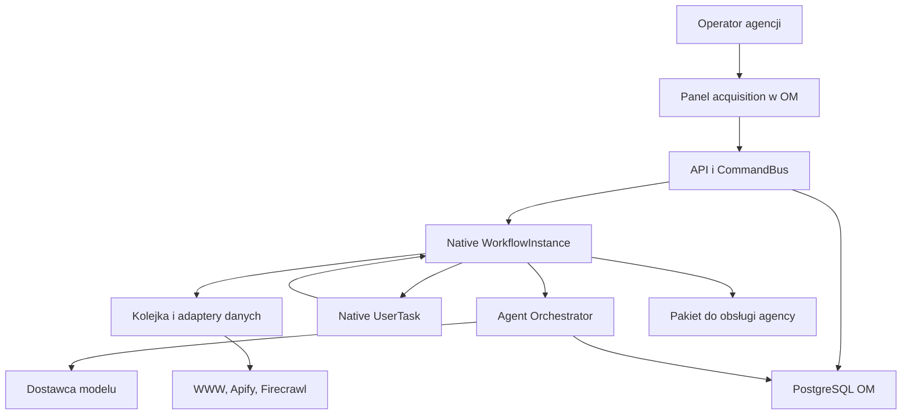
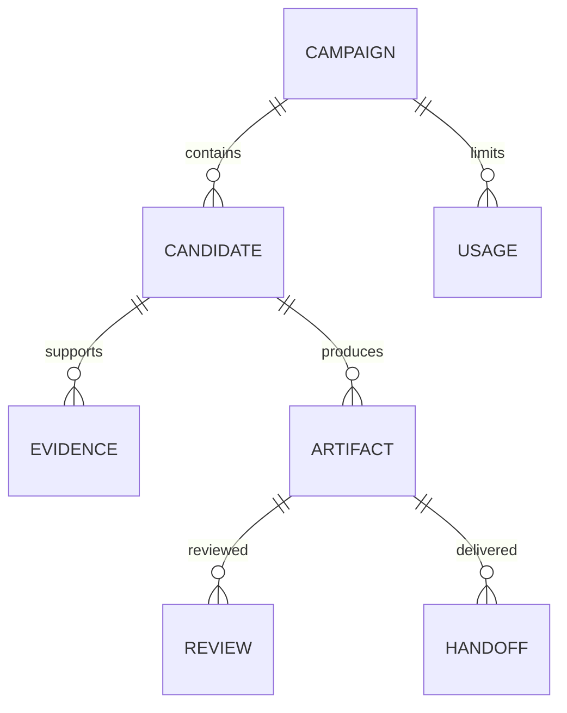

# Architektura implementacyjna

**Decyzja:** moduł `acquisition` w Open Mercato. Natywny Agent Orchestrator wykonuje role AI; moduł Workflows prowadzi sprawę. Cezar realizuje zadania programistyczne w osobnych katalogach roboczych Git (worktree). Zewnętrzne usługi dostarczają dane lub model. Repo nie zawiera drugiego backendu, CRM ani silnika workflow.

Przypięte wersje i środowisko wykonania: [manifest](../config/upstream.json). Opisujemy docelowe zachowanie; faktycznie uruchomione elementy i ograniczenia są w [raporcie testów](09-VALIDATION.md). Pojedynczych agentów można uruchomić w środowisku ewaluacyjnym; pakiet enterprise nie jest kopiowany. [Licencja upstream](https://github.com/open-mercato/open-mercato/blob/ab23d45ffc3aeca5e7d994eb57d5526c5b0a4712/packages/enterprise/LICENSE.md) musi być uwzględniona przed komercyjnym uruchomieniem.

## 1. Mapa odpowiedzialności



| Obszar | Właściciel | Granica |
|---|---|---|
| Logowanie, tenant, organizacja, uprawnienia | OM | Backend wyznacza zakres dostępu (scope); model i klient HTTP nie mogą go podmienić. |
| Dane kandydatów i dowody | acquisition + MikroORM | Encje poniżej; CRM dopiero po potwierdzeniu dopasowania tożsamości. |
| Kolejność, ponowienia, wstrzymanie i wznowienie | OM Workflows | Jedna instancja `WorkflowInstance` na wykonanie; status kandydata jest projekcją. |
| Wykonanie modelu i ślad diagnostyczny | OM Agent Orchestrator | Natywny `AgentRun`; nie tworzymy własnego rejestru uruchomień. |
| Prompty, wyniki, ocena | acquisition agent pack | Wynik `research` jest materiałem roboczym. Każdy wynik przechodzi walidację. |
| Pobranie danych | adaptery w kolejce OM | Limit czasu, limity danych, lista dozwolonych połączeń wychodzących, kompletność, koszt i źródło. |
| Zgoda na pakiet | Natywny `UserTask` + `ReviewDecision` | Decyzja przypięta do rewizji i hasha treści. |
| Wysyłka/zakup/realizacja usługi | poza tym modułem | P0 przygotowuje materiał roboczy oraz eksport lub przekazanie; nie wysyła wiadomości do potencjalnych klientów. |

## 2. Struktura repo i hosta

| Tutaj | W hoście OM / zastosowanie |
|---|---|
| `modules/acquisition/` | `apps/mercato/src/modules/acquisition/` w przypiętym checkout; docelowy kod modułu |
| `contracts/` | stały punkt importu i ponowne eksporty; implementacja walidatorów wewnątrz samowystarczalnego modułu |
| `fixtures/` | jawnie syntetyczne wejścia developerskie, nie baza prawdziwych leadów |
| `tests/` | testy pakietu; testy hosta osobno w jego konwencji |
| `docs/`, `tasks/`, `backlog/` | specyfikacja, stories, kontrakty odbioru i kolejka prac |
| `.ai/cezar/workflows/`, `.ai/skills/` | instrukcje dla agentów kodujących, odrębne od skilli biznesowych OM |
| `.runtime/` | lokalny, ignorowany host OM; nigdy nie zapisujemy w Git kodu upstream enterprise ani danych dostępowych |
| `evidence/` | zanonimizowane wyniki weryfikacji z pinem, poleceniem i ograniczeniami |

Moduł bazowy: `index.ts`, `acl.ts`, `di.ts`, `data/entities.ts`, `data/validators.ts`, `commands/`, `api/`, `backend/`, `workers/`, `events.ts`, `ai-agents.ts`, `ai-skills.ts`. Specyfikacja karty decyduje, które z tych plików powstają w danym zadaniu. Brak pliku nie jest gotową funkcją.

## 3. Jedna własność stanu

Kampania określa ofertę, segment i budżet. Kandydat jest firmą w kampanii. Wykonanie procesu jest przypięte do wersji oferty i snapshotu źródeł. `WorkflowInstance` przechowuje status wykonania, oczekiwanie i wznowienie; projekcja biznesowa pokazuje operatorowi etap. `AgentRun` przechowuje ślad pojedynczego wykonania modelu. Zapis artefaktu następuje przez komendę dopiero po walidacji koperty, reguł dowodowych i zgodności scope.

Zmiana źródeł lub oferty tworzy nowy manifest wejścia. Nie nadpisuje historii. Wyniki zależne od zmienionego wejścia stają się `stale`; zgoda na stary hash nie zatwierdza nowej wersji. P0 wymaga jawnego ponownego uruchomienia; automatyczna propagacja zmian jest P1.

## 4. Model danych

Wspólne pola encji: `id uuid`, `tenant_id uuid NOT NULL`, `organization_id uuid NOT NULL`, `created_at timestamptz`, `updated_at timestamptz`. Encje, które można aktualizować, mają `version integer` do wykrywania równoczesnych zmian. Tenant i organizacja występują również w indeksach i warunkach zapytań po identyfikatorze. Relacje do innych modułów wyłącznie przez identyfikatory, bez relacji ORM między modułami.

| Encja / tabela | Pola domenowe | Ograniczenia i indeksy |
|---|---|---|
| AcquisitionCampaign / `acquisition_campaigns` | name, offer_snapshot jsonb, offer_version, offer_approved_at, criteria jsonb, provider_policy jsonb, budget_limit numeric(12,4), currency, status | zatwierdzona oferta wymagana przed komunikowaniem ceny; waluta kosztów API USD, cena oferty PLN — bez cichego przeliczania |
| AcquisitionCandidate / `acquisition_candidates` | campaign_id, company_name, canonical_domain, crm_company_id nullable, source_route, identity_status, decision_status, reason_codes jsonb, current_workflow_id nullable, last_assessed_at | unique(tenant_id,organization_id,campaign_id,canonical_domain); domena może być null do rozstrzygnięcia; nazwa nie jest kluczem |
| EvidenceSnapshot / `acquisition_evidence_snapshots` | candidate_id, source_url, source_type, provider, data_mode, captured_at, published_at nullable, content_text, content_hash, completeness, collection_error nullable, metadata jsonb, expires_at | wyłącznie dopisywanie; unique(scope,candidate_id,source_url,content_hash); brak daty publikacji nie jest datą pobrania; `live/fixture/import` zawsze widoczne |
| AcquisitionArtifact / `acquisition_artifacts` | candidate_id, type, revision, schema_version, payload jsonb, input_manifest jsonb, content_hash, producer_agent_run_id nullable, quality_status, stale_at nullable | unique(scope,candidate_id,type,revision); treść rekordu niezmienna; nowa treść = nowa rewizja |
| ReviewDecision / `acquisition_review_decisions` | candidate_id, artifact_id, artifact_hash, action, reason, revise_from nullable, actor_user_id, native_user_task_id, decided_at | wyłącznie dopisywanie; jedna skuteczna decyzja na UserTask/rewizję; użytkownik z aktualnym prawem review |
| HandoffReceipt / `acquisition_handoff_receipts` | candidate_id, artifact_id, artifact_hash, request_id, target, target_record_id nullable, status, completed_at nullable, failure_code nullable | unique(scope,request_id); ponowienie zwraca to samo potwierdzenie; eksport nie oznacza zakupu |
| ProviderUsage / `acquisition_provider_usage` | campaign_id, candidate_id, request_id, provider, reserved_usd, actual_usd nullable, status, tokens_in/out nullable, latency_ms, attempt | unique(scope,provider,request_id,attempt); rezerwacja przed wywołaniem; rozliczenie dokładnie raz; przekroczenie czasu o nieznanym koszcie zachowuje rezerwację |



Migracje generuje oficjalne narzędzie OM; integrator przegląda SQL, indeksy scope i plan wycofania migracji. Nie podajemy ręcznego SQL jako zamiennika migracji. W P0 zaczynamy od nowej, pustej bazy. Cofnięcie wersji po zebraniu danych nie może usuwać historii bez świadomej decyzji administratora.

**Dwie osobne pule kosztów:** `AcquisitionCampaign.budget_limit` i `ProviderUsage` dotyczą dostawców API w USD. Koszt wewnętrznego przygotowania researchu/próbki pozostaje w PLN: limit `preparationBudgetPln` w kryteriach kampanii oraz `estimatedPreparationCostPln` w wejściu oceny dopasowania. Cena sprzedawanej usługi w `offer.pricePln` jest jeszcze inną wielkością — nie jest kosztem researchu ani ceną produktu klienta. Nie dodajemy USD do PLN, nie pobieramy automatycznie kursu i nie pokazujemy sumy mieszającej obie waluty. Brak kosztu jest wartością nieznaną, nie zerem.

## 5. Kontrakty HTTP i komend

Prefiks adresów aplikacji: `/api/acquisition`. JSON; scope z sesji/API key OM. Brak uprawnień: 403; obcy lub nieistniejący obiekt: 404; niepoprawny format danych: 400; nieaktualna wersja lub hash: 409; przekroczony limit: 429; niedostępny dostawca lub konfiguracja: 503. Błędy `{error:{code,message,retryable,requestId}}`, bez sekretów ani pełnej treści strony. `Idempotency-Key` wymagany na create/run/decision/handoff. Ta sama wartość klucza przy innej treści żądania zwraca 409.

| Metoda i ścieżka | Wejście | Wyjście i semantyka |
|---|---|---|
| POST `/campaigns` | name, offerSnapshot, criteria, budgetLimitUsd | 201 `{id,version,status:'draft'}`; CommandBus `acquisition.campaigns.create` |
| POST `/campaigns/:id/activate` | expectedVersion, approvedOfferVersion | 200 campaign; brak zatwierdzonej oferty blokuje komunikowanie ceny, nie research |
| GET `/campaigns/:id/summary` | — | 200 `{counts,unknowns,approvedPackCost,outcomes}`; podsumowanie T22 w bieżącym scope, osobno dla danych syntetycznych i rzeczywistych; brak danych o koszcie → `unavailable`, brak pomiaru sprzedaży → `not_measured` |
| POST `/campaigns/:id/candidates` | companyName, websiteUrl?, profileUrls[], sourceRoute, seedEvidence? | 201 dla nowego lub 200 dla istniejącego rekordu `{candidateId,deduplicated,identityStatus}` |
| GET `/candidates` | campaignId, decisionStatus?, cursor?, limit<=50 | wynik ograniczony do bieżącej organizacji, z podziałem na strony: `{items,nextCursor}`; bez pełnych tekstów źródeł |
| GET `/candidates/:id` | — | kandydat, ostatnie artefakty, bieżący etap workflow i koszty; źródła i hash |
| POST `/candidates/:id/identity` | expectedVersion, websiteUrl, profileUrl?, evidenceIds[], decision:'confirm'|'reject'|'hold', reason | zapis decyzji operatora przez `acquisition.identity.resolve`; współdzielona domena/oddział w MVP pozostaje unknown lub wykluczony; brak automatycznego scalenia |
| POST `/candidates/:id/resume` | expectedVersion, nativeUserTaskId, resolution:'identity_resolved'|'context_added'|'source_replaced'|'budget_extended'|'quality_revised'|'review_released', resolutionArtifactId, reason | 202 `{workflowId}`; sprawdza istnienie artefaktu, uprawnienie i dopasowanie przyczyny do oczekującego zadania; sygnał do tej samej native WorkflowInstance |
| POST `/candidates/:id/evidence` | bounded importSnapshot, expectedVersion | niezmienny snapshot; `dataMode:'import'`; walidacja rozmiaru/dat/URL |
| POST `/candidates/:id/run` | expectedVersion, requestedFromStep? | 202 `{workflowId,candidateId}`; start przez natywny ProcessDefinition; istniejący aktywny run=409 |
| POST `/candidates/:id/review` | artifactId, artifactHash, expectedVersion, action, reason?, reviseFrom? | decision+native UserTask completion; `approve/revise/discard/hold`; nie wysyła |
| GET `/candidates/:id/packet` | artifactId | tylko autoryzowany JSON/HTML z danymi trybu i źródeł |
| POST `/candidates/:id/handoff` | approvedArtifactId, approvedHash, target:'export'|'agency', requestedNextStep | receipt; `agency` wymaga potwierdzonego odbiorcy adaptera; P0 export |

Podsumowanie kampanii czyta istniejące `AcquisitionArtifact`, `ReviewDecision`, `ProviderUsage` i `HandoffReceipt`. Wynik dalszej obsługi zapisujemy w P0 jako `AcquisitionArtifact` z `type='outcome'`, a nie w nowej tabeli zdarzeń. Taki artefakt zawiera wynik, czas zdarzenia, autora zapisu, źródło i tryb danych; `won` wymaga odnośnika do zamówienia lub ręcznego uzasadnienia. Brak odpowiedzi nie staje się automatycznie przegraną sprzedażą. Zdarzeń syntetycznych nie włączamy do rzeczywistej konwersji.

`approvedPackCost` opisuje koszt dostawców API przypadający na zaakceptowany pakiet i ma jawne oznaczenie USD. Brak zaakceptowanych pakietów albo niepełne dane o rozliczeniu oznaczają `unavailable`. Wewnętrzny koszt przygotowania w PLN pokazujemy osobno; odczyt podsumowania nie dokonuje przeliczenia walut ani nie zapisuje wyników procesu.

Przykład decyzji:
```json
{"artifactId":"uuid","artifactHash":"sha256:...","expectedVersion":3,"action":"approve","reason":"Dowody i próbka sprawdzone"}
```

Wewnętrzne komendy: `acquisition.evidence.append`, `acquisition.artifacts.create`, `acquisition.candidates.set-assessment`, `acquisition.reviews.decide`, `acquisition.handoffs.create`, `acquisition.usage.reserve`, `acquisition.usage.settle`. Każda otrzymuje zakres dostępu z kontekstu CommandBus, parsuje dane i sprawdza aktualną rewizję. Aktywność `UPDATE_ENTITY` wykorzystuje wyłącznie jawnie zarejestrowane safe commands włączone per tenant i uprawnionego wykonawcę. Samo dodanie do katalogu nie nadaje uprawnień.

## 6. Agent i workflow

`agentType:'researcher'` jest typem roli, `result.kind:'research'` kopertą wyniku. Wszystkie 9 ról jest read-only. Pole `data.status` ma znaczenie biznesowe i nie jest statusem AgentRun. Ukończony run może zwrócić `needs_input` — wtedy workflow kieruje do interwencji, a nie do gotowego pakietu.

Natywna aktywność jest osadzona w kroku:
```json
{"stepId":"P05","stepName":"Diagnoza","stepType":"AUTOMATED","activities":[{"activityId":"P05-audit","activityName":"Sprawdź komunikację","activityType":"INVOKE_AGENT","config":{"agentId":"acquisition.signal_auditor","input":{},"onResult":{"alwaysAsk":true},"outputMapping":{"assessment":"data"}}}]}
```
To fragment struktury, nie gotowy import całego procesu. Karta workflow musi dostarczyć pełny graf sprawdzony `workflowDefinitionDataSchema`, mapowanie danych i legalne przejścia. Nie wpisywać `INVOKE_AGENT` jako stepType. Research nie tworzy proposal; `alwaysAsk` nie zastępuje P12 UserTask.

Ponowienie wywołania modelu: maksymalnie jedna poprawa formatu/dowodów z konkretną listą naruszeń. Poprawka treści po kontroli jakości: maksymalnie jedna automatyczna próba, potem człowiek. Ponowienie wywołania dostawcy: najwyżej dwa podejścia, wyłącznie przy błędzie oznaczonym jako możliwy do ponowienia i z budżetem. Globalny limit czasu oraz `requestId` zapobiegają nieograniczonej pętli. Przekroczenie czasu i brak danych widoczne jako osobne przyczyny.

Pauzy mają kontrakt `{reasonCode,requiredArtifactType,nativeUserTaskId,workflowId,expectedVersion}`. Rozstrzygnięcie przez `/identity` zapisuje dowód, a `/resume` wznawia dokładnie to oczekujące zadanie. Nie tworzy drugiego runu. Obsługiwane powody: identity_unresolved, missing_context, source_unavailable, budget_limit, quality_failed, review_hold. Dla jakości `revise` z P12 wymaga `reviseFrom=P07|P08|P09|P11` i uruchamia nową rewizję na istniejącej sprawie; dla pozostałych wymagany jest wskazany brakujący materiał. `quality_revised` wymaga nowej rewizji ze zdanym quality gate. `review_released` wymaga nowego artefaktu decyzji operatora z powodem i jest legalne tylko dla `review_hold`; wraca do P12 i nie zatwierdza pakietu. `revise`, `hold` i `discard` wymagają niepustego powodu. P0 nie używa ogólnego „kontynuuj mimo błędu”.

Sezonowość: dowód `expected_pause` unieważnia sam sygnał przerwy (`cadenceProblem=false`); niezależny udokumentowany problem treści nadal może przejść P06. Jeśli żaden problem nie pozostał, sprawa kończy się `not_fit`. Nierozstrzygnięta sezonowość prowadzi do `missing_context`. Firma/oddział na wspólnej domenie jest jawnym ograniczeniem MVP — wymaga ręcznego wykluczenia/hold, nie obejścia klucza deduplikacji.

## 7. Źródła i egress

P0 obsługuje początkowy adres URL i import snapshotu oraz ograniczone pobranie publicznej strony WWW. Społecznościowe dane wymagają właściwego adaptera i dostępu; konfiguracja nie udaje udanego pobrania. Firecrawl ma pierwszeństwo dla złożonych stron. Apify służy do historii postów, jeśli skonfigurowany. Octolens jako alternatywny kanał pozyskiwania jest P1. Każdy adapter implementuje jeden kontrakt, więc agent nie wybiera sam poświadczeń ani klienta HTTP.

Wywołanie zawiera `{requestId,scope,candidateId,sourceUrl,maxItems,deadlineAt,budgetReservationId}`. Wynik `{status:'ok'|'partial'|'unavailable',snapshots,completeness,error,cost}`. Adapter pobierania blokuje prywatne adresy IP, localhost, dane dostępowe w URL, nie-HTTP, sprawdza DNS i każde przekierowanie; ogranicza rozmiar odpowiedzi i czas pobierania. Nie wykonuje JS źródła. Polityka egress pochodzi z konfiguracji operatora, nie z wygenerowanego URL.

Logo agencji to źródło kandydata, nie dowód aktualnej umowy czy budżetu. Historia niekompletna nie uruchamia automatycznej diagnozy porzucenia marketingu. Wersję roboczą materiału tworzymy wyłącznie z podanych faktów; brak wartościowego kontekstu zatrzymuje PoC.

## 8. Handoff do obecnej obsługi

`acquisition.handoff.v1` zawiera odwołania do kandydata i firmy, zatwierdzoną wersję oferty (lub jawne `unapproved`), problem i źródła, brief odbiorcy, próbkę, decyzję operatora, requestedNextStep oraz klucz idempotencji. Nie zawiera sfałszowanego potwierdzenia zakupu. Docelowy moduł `agency` potwierdza odbiór; eksport kończy się `exported`, nigdy `accepted_by_agency`. Sprzedaż, zgoda klienta, umowa/płatność i pełna realizacja usługi pozostają w istniejącym procesie.

Pakiet zawiera `comparisonStatus:new_wins|tie|original_wins|not_comparable`, `commercialReadiness` i `requestedNextStep:internal_review|sales_conversation`. Oferta w statusie `proposal` albo wynik inny niż new_wins pozwalają jedynie na oznaczony pakiet wewnętrzny bez twierdzenia o poprawie i bez ceny. Samo przejście kontroli jakości oznacza poprawność materiału; nie dowodzi przewagi nad oryginałem. Aby zatwierdzić pakiet handlowy z obietnicą poprawy, wymagane są zatwierdzona oferta, `new_wins`, pozytywna kontrola jakości oraz zgoda na aktualny hash. Uprawnienie do kontaktu pozostaje osobną, hostową decyzją, nie skutkiem flagi `commercialReadiness`.

## 9. Obserwowalność i minimalne bezpieczeństwo

Każdy ekran i log ma campaignId/candidateId/workflowId/runId/requestId; ślad diagnostyczny bez sekretów. Minimum metryk: rozpoznane firmy, kandydaci z dowodem, zaakceptowane pakiety, koszt pakietu, czas człowieka, odrzucenia i przyczyny. Odpowiedź/zamówienie liczymy dopiero z realnego zdarzenia. Nie nazywamy odczytu, eksportu czy oceny modelu konwersją.

Retencja do pilota: 30 dni surowych snapshotów i 90 dni spraw bez dalszej obsługi — konfigurowalne założenie operacyjne, nie wykładnia prawa. Usunięcie/ograniczenie danych i sprzeciw muszą propagować do kolejki kontaktu; prywatne kontakty nie są potrzebne w demo. Warunki wysyłki wymagają oddzielnej oceny kanału. Szkic wiadomości z poradą nie oznacza automatycznej zgody na marketing.

## 10. Źródła decyzji

- [OM SDK defineAgent](https://github.com/open-mercato/open-mercato/blob/ab23d45ffc3aeca5e7d994eb57d5526c5b0a4712/packages/enterprise/src/modules/agent_orchestrator/lib/sdk/defineAgent.ts)
- [Native run route](https://github.com/open-mercato/open-mercato/blob/ab23d45ffc3aeca5e7d994eb57d5526c5b0a4712/packages/enterprise/src/modules/agent_orchestrator/api/agents/%5Bid%5D/run/route.ts)
- [Materialize single agent workflow](https://github.com/open-mercato/open-mercato/blob/ab23d45ffc3aeca5e7d994eb57d5526c5b0a4712/packages/enterprise/src/modules/agent_orchestrator/lib/processes/materializeAgentWorkflow.ts)
- [Cezar](https://github.com/open-mercato/cezar) i [OM spec-writing](https://github.com/open-mercato/skills/tree/main/skills/om-spec-writing)

Adaptacja metody: najpierw problem, założenia i granice; następnie widoki architektury, kontrakty, wyjątki, małe, sprawdzalne zadania. Jedna tabela kontraktu zastępuje rozproszone opisy. Dokumentacja nie gwarantuje działania — dowód wskazuje konkretny test i warstwę.

### Mapowanie wersji w komendzie review

HTTP `expectedVersion` dotyczy optymistycznej blokady kandydata. Host osobno pobiera `artifact.revision` i przekazuje ją do czystej funkcji jako `expectedRevision`; API nie przyjmuje rewizji modelu jako prawdy. `reason` i `reviseFrom` są utrwalane w ReviewDecision. Po revise host oznacza zależne artefakty jako nieaktualne i kieruje native workflow od wskazanego etapu, zachowując historię.
